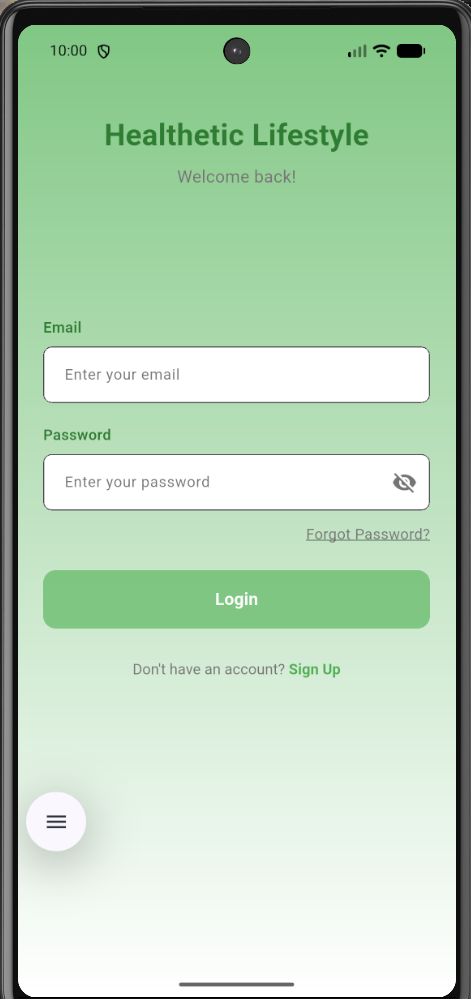
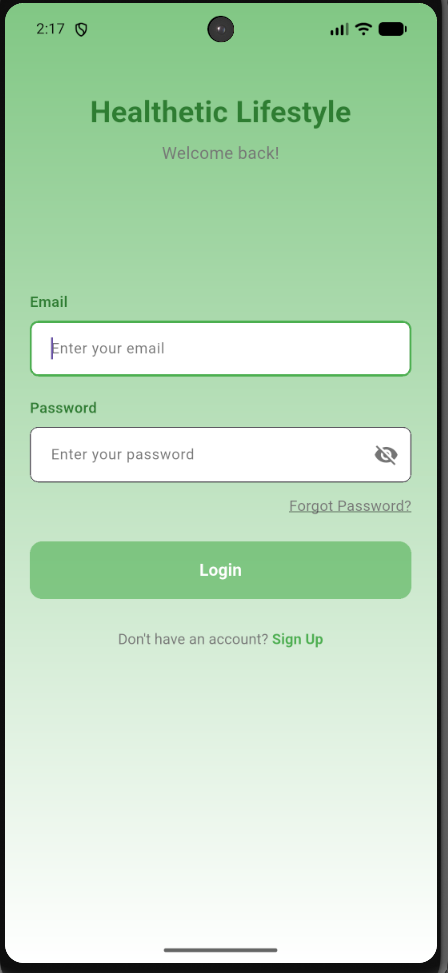
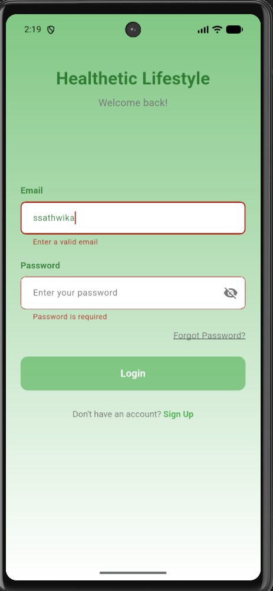
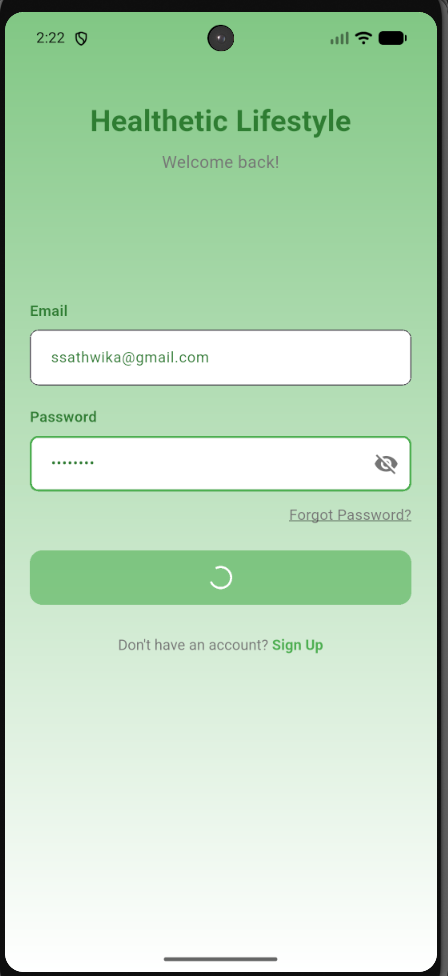

# health_lifestyle

A new Flutter project.

## Getting Started
# Healthetic Flutter Login Assignment

## Project Description

This project is a Flutter login screen developed for the Healthetic Flutter assignment.
It demonstrates a clean UI design, form validation, animations, and reusable widgets.

---

# Screenshots

### Idle State

### Focused State

### Validation Error

### Loading State

---

# Prerequisites

Before running this project, make sure you have:

* Flutter 3.x
* Dart 3.x
* Android Studio or VS Code

---

# Setup Instructions

Clone the repository

git clone https://github.com/your-username/healthetic-flutter-login-assignment-sathwika

Go to the project folder

cd healthetic-flutter-login-assignment-sathwika

Install dependencies

flutter pub get

Run the application

flutter run

---

# Demo Video

Add your demo video link here.

Example:

https://drive.google.com/your-demo-video-link

---

# Approach & Design Decisions

* Implemented a clean and modular Flutter architecture.
* Used reusable widgets for text fields and buttons.
* Added email and password validation using Flutter Form.
* Implemented button loading animation for better user experience.
* Used a gradient background for modern UI appearance.

---

# Author

Sathwika

